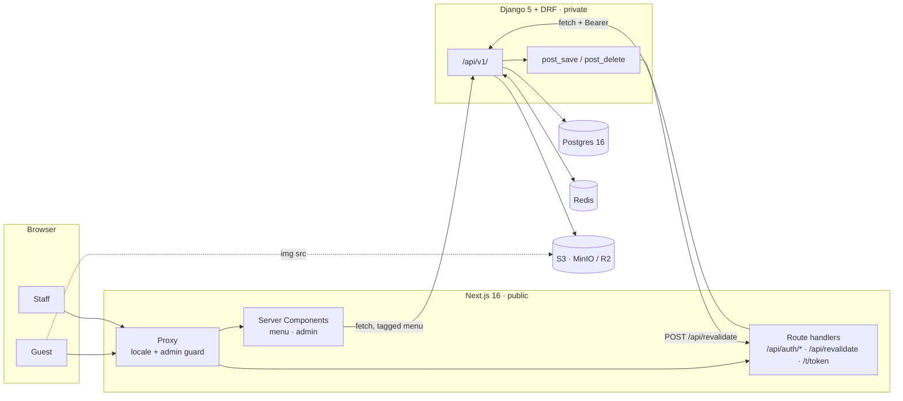
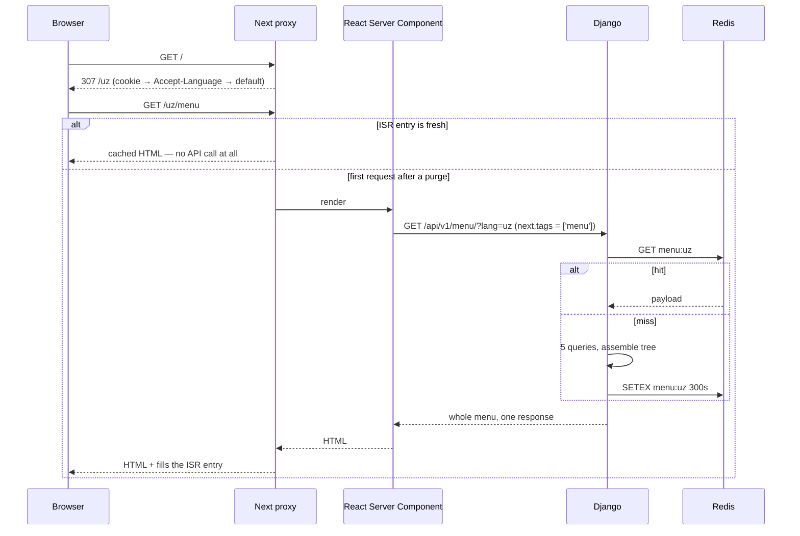
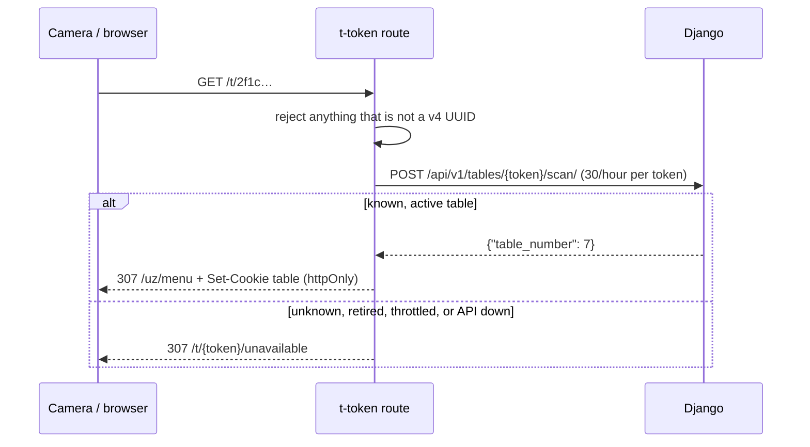
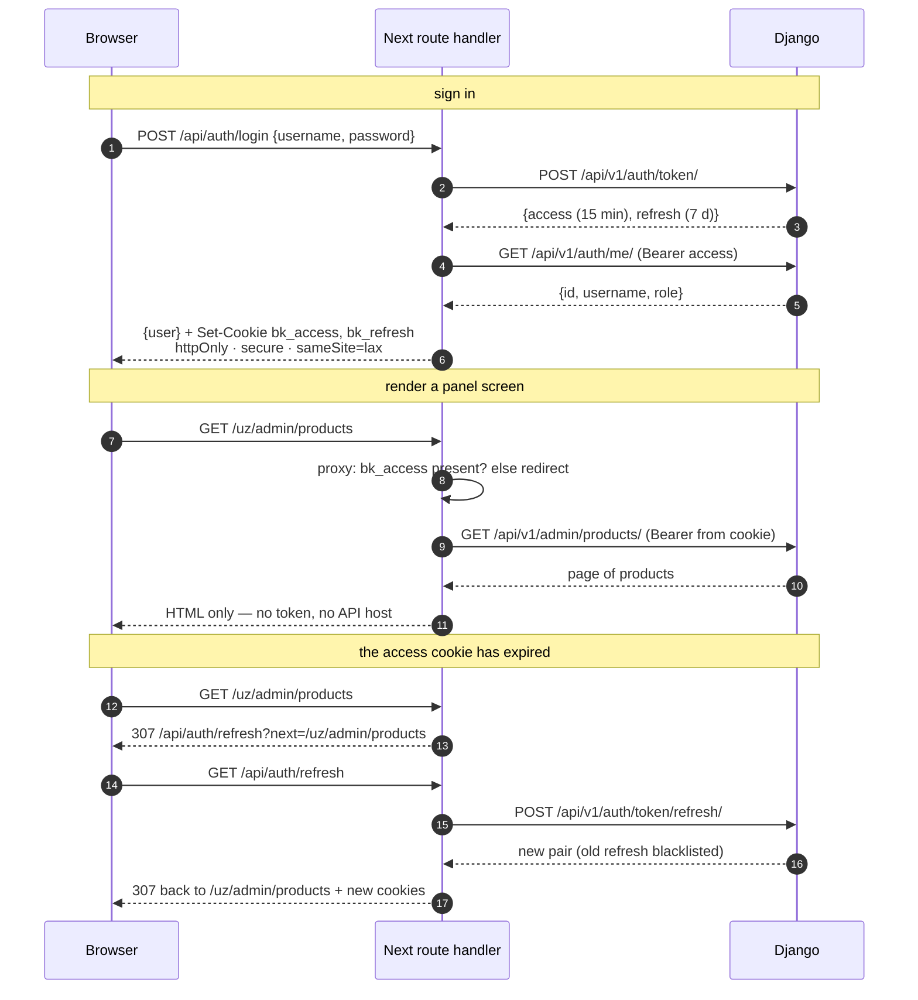
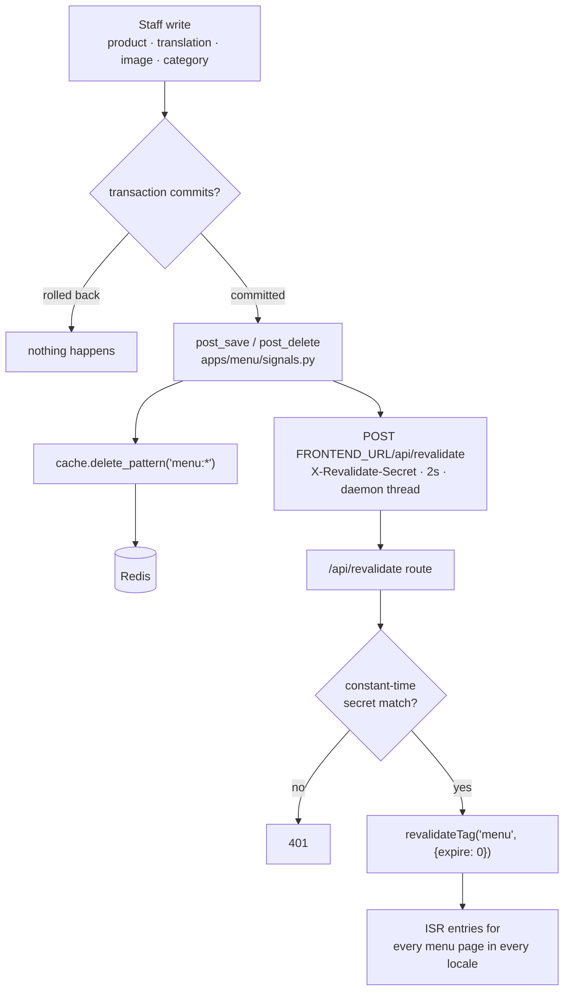
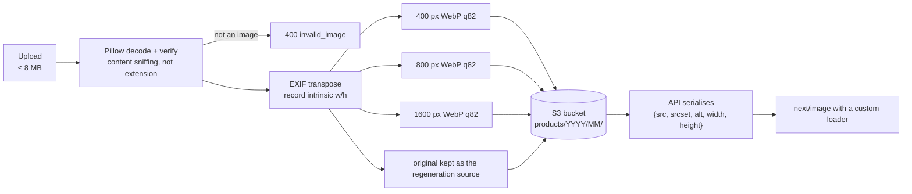
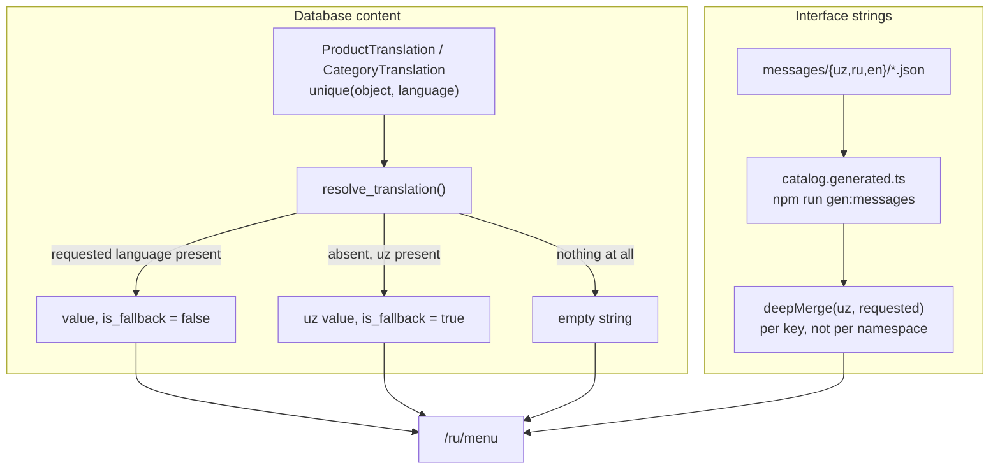

# Architecture

Two services. Next.js faces the internet and is the only thing a browser talks to; Django
holds the data and is reachable only from Next.js and from its own operators. Everything
below follows from that split — see [ADR-001](DECISIONS.md#adr-001-two-services-next-for-delivery-django-for-data).

The browser never holds an API address, an access token or a credential. `API_INTERNAL_URL`
has no `NEXT_PUBLIC_` prefix, and `src/lib/api.ts` imports `server-only`, so an accidental
client import is a build error rather than a leak.

## Request flow

### A guest opening the menu

The whole menu — categories, subcategories, products, image `srcset`s — arrives in one
response. The catalogue is under a hundred dishes and the page is prerendered, so a single round trip
beats a request per section, and `apps/menu/api/aggregate.py` is written so the query plan
stays at five statements regardless of how many dishes exist.

Every filter is prerendered: `/uz/menu`, each section, each subsection, in all three
languages — 58 static pages at the last build. Filtering by category is navigation between
real URLs, not `useState`, so a category is linkable, indexable and survives a reload.
Search is the exception: it filters the already-loaded payload in the client, because the
data is already there and a round trip per keystroke would be strictly worse.

### A guest scanning a table QR code

The sticker encodes `https://<site>/t/<uuid>`, a route handler outside the `[locale]`
segment — a sticker cannot know which language its reader speaks.

The QR carries a UUID, never the table number, so the codes cannot be enumerated by
counting. Which of the four failure modes occurred is the operator's problem, not the
guest's, so all four render the same page.

## The BFF auth model

The original application compared an admin password in client JavaScript and recorded the
result as `localStorage.adminToken = "authenticated"`. This is the exact inverse: the token
is minted by Django, held by Next.js in cookies the document cannot read, and attached to
every admin call server-side.

Four properties make this hold up:

**The cookie lifetime is the token lifetime.** `bk_access` is written with
`maxAge = 15 min`, matching `SIMPLE_JWT.ACCESS_TOKEN_LIFETIME`. An expired token therefore
leaves no cookie behind, and the proxy can distinguish *expired* (`bk_refresh` still there
→ renew) from *signed out* (nothing → login) without decoding anything. The edge runtime
never parses a JWT.

**The proxy only redirects; it never authorises.** It is a cheap pre-filter that keeps an
expired session from rendering a flash of the panel. The real gate is
`app/[locale]/admin/(dashboard)/layout.tsx`, a Server Component that asks
`GET /auth/me/` who the bearer is before returning any markup. Signature, expiry and role
are all checked by Django, so a forged cookie produces a redirect, not a session. There is
no client-side guard anywhere in the panel — unauthenticated requests never receive admin
HTML at all, which is exactly how the original leaked its whole interface.

**Refreshing happens on Node, never at the edge.** `src/middleware-auth.ts` imports nothing
but `next/server` and the locale list, because the edge bundle has no `next/headers`, no
`server-only` and no request-time `process.env`. Every token exchange is therefore a
redirect to `/api/auth/refresh`, a Node route handler. Server Actions and route handlers,
which *can* write cookies, renew inline via `requireAccessToken()` instead of bouncing.

**Rotation makes a failed refresh terminal.** `ROTATE_REFRESH_TOKENS` and
`BLACKLIST_AFTER_ROTATION` are on, so a refresh token is single-use. A 401 from the refresh
endpoint clears both cookies and sends the user to the login form; there is no retry loop.

Two details that are easy to get wrong:

- `secure: true` is unconditional. Browsers treat `http://localhost` as a trustworthy
  origin, so development works, while a deployment over plain HTTP fails visibly instead of
  quietly downgrading.
- The login form posts JSON when its script is alive and a plain
  `application/x-www-form-urlencoded` form when it is not. Without the second path a broken
  bundle would leave the browser submitting with its default method — putting the password
  in the URL and in history.

The one place the browser makes an authenticated request itself is image upload
(`/[locale]/admin/products/[id]/images`), and even there it uploads to *Next*, which adds
the bearer and streams the file on to Django. It exists as a route handler rather than a
Server Action only because `XMLHttpRequest` progress events need a request the client
controls. The browser gains a progress bar; it does not gain a token.

## Caching and invalidation

Two caches sit in front of the same data, and one signal clears both.

| Layer | Key / tag | Lifetime | Cleared by |
|---|---|---|---|
| Redis menu aggregate | `menu:<lang>` | 300s TTL | `delete_pattern('menu:*')` on any menu write |
| Next.js data cache | fetch tag `menu`, `revalidate: false` | until purged | `revalidateTag('menu')` from the webhook |
| Next.js ISR pages | same tag | until purged | same |
| Object storage | immutable keys | `max-age=31536000, immutable` | never — a new upload is a new key |

Points worth naming:

- The flush is deferred to `transaction.on_commit`. `ATOMIC_REQUESTS` wraps each request in
  a transaction, and dropping the cache *before* it commits would let a concurrent read
  repopulate the cache from the pre-write snapshot — a stale entry with no TTL left to save
  it.
- The ping is fire-and-forget on a daemon thread with a 2s timeout and every failure
  swallowed into the log. A slow or dead frontend must never make a staff save hang. The
  300s Redis TTL is the backstop if the ping is lost.
- The webhook compares the shared secret with `timingSafeEqual`. String `===`
  short-circuits at the first differing byte, which leaks the secret to anyone who can time
  the response. Unequal lengths are rejected first; that reveals the length, which is not
  the secret. A missing `REVALIDATE_SECRET` returns 503 rather than defaulting to a
  well-known value.
- `revalidateTag(tag, {expire: 0})` rather than a background-refresh profile: the webhook
  is telling us the data is *already* wrong, so the next guest must not be served the stale
  menu while a refresh catches up.
- Admin reads use `cache: 'no-store'`. Staff must see what they just saved.

End to end, a price edit is visible on the public menu in roughly two seconds, with no
deploy and no rebuild.

## Image pipeline

Photos are the reason the original menu was ~10 MB: each one was a base64 data URL inside
its Firestore document.

- **Validation is a decode, not an extension check.** A `.png` full of shell script fails
  in `open_image()`. Pixel count is capped at 50M as a decompression-bomb guard, bytes at
  8 MB.
- **Derivative keys are deterministic** — `<base>-400.webp`, `-800`, `-1600` — so the
  `srcset` dict always has the same three shapes. Storage is configured with
  `file_overwrite: False`, which would rename a colliding key and break that, so
  regeneration deletes before writing.
- **Never upscale.** A 500px original still produces all three keys; the wider ones are
  just the same 500px.
- **`width`/`height` of the original are stored** so the frontend reserves the box before
  the bytes arrive. Combined with a fixed 4:3 crop, the grid has no cumulative layout
  shift.
- **A custom `next/image` loader** (`src/features/menu/imageLoader.ts`) picks the smallest
  derivative that covers the requested width. Next's optimiser is bypassed on purpose:
  re-encoding an already-optimised WebP means a second lossy pass, a `/_next/image` hop in
  front of object storage, and server CPU spent redoing work Django already did. The
  `srcset`/`sizes`/CLS machinery is kept.
- **No image is not a broken image.** The API returns `image: null` and the frontend
  renders a gold monogram placeholder derived from the product name.
- **Deletion is complete.** A `post_delete` receiver removes the original and all three
  derivatives, including on cascade from a deleted product, so nothing orphaned keeps
  billing.
- Objects are served with `Cache-Control: public, max-age=31536000, immutable`, which is
  safe precisely because keys are never reused.

## Internationalisation

Three languages, one fallback rule, applied identically to database content and interface
strings: **a missing translation renders Uzbek, never a blank and never a raw key.**

**URLs.** `localePrefix: 'always'` — `/uz/...`, `/ru/...`, `/en/...`, no unprefixed
variant. Each language has exactly one canonical URL, every page emits `hreflang`
alternates for the other two, and `/` redirects by cookie → `Accept-Language` → `uz`.

**Content.** Translations are rows in side tables, not a JSONB column, so "which products
lack a Russian name?" is one indexed query — and the admin panel shows that count, which is
how 74 silently-untranslated products stopped being invisible. `resolve_translation()`
implements the fallback once, in `apps/common/translations.py`, and every serializer reuses
it; the API marks each fallback with `is_fallback` so the panel can distinguish "translated
into Uzbek" from "shown in Uzbek because nothing else exists".

**Interface.** Message JSON is split by namespace (`common`, `menu`, `admin`, `tables`) and
compiled into `src/i18n/catalog.generated.ts` at build time, so the catalog is a typed
module rather than a runtime `import()` of JSON. `getMessagesForLocale` deep-merges the
requested locale over Uzbek key by key, so a half-translated namespace degrades one string
at a time. No user-facing string is written in a component — that rule is what makes adding
a fourth language a data change rather than a refactor.

**Search** folds accents and the four Uzbek apostrophe variants on both sides of the
comparison. Postgres `unaccent` would need a superuser `CREATE EXTENSION` on every
environment including throwaway test databases, so `apps/common/api/search.py` builds an
equivalent folding table from Unicode decomposition at import time and feeds it to the
built-in `translate()`. `Cho'rak`, `Choʻrak` and `Chorak` all find the same bread.

**Time** is `Asia/Tashkent` on both sides; the API speaks ISO 8601 UTC on the wire.
